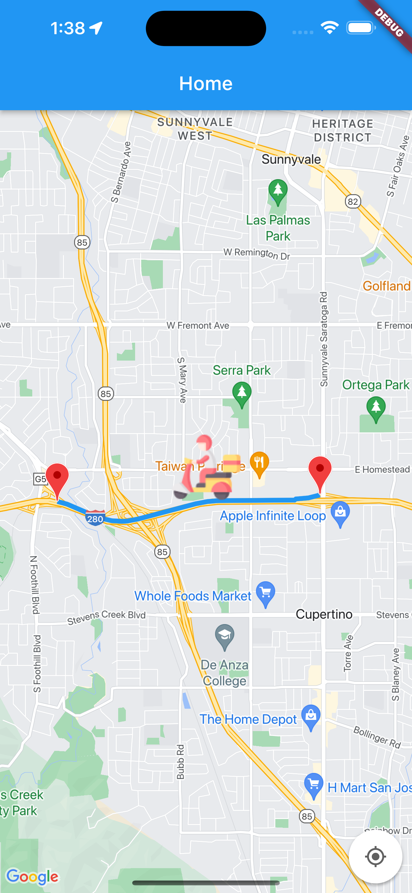

# Delivery Boy

A sample Flutter app that demonstrates the use of basic features of the Flutter framework.

## Screenshots

 


## Features
- Realtime location updates
- Maps integration using Google Maps API
- Polyline integration


## Getting Started

1. Clone the repository
```
git clone https://github.com/alok2811/driver_app.git
```

2. Go to the project directory

3. Install the dependencies
```
flutter pub get
```
4. Run the app
```
flutter run
```

## License
This project is licensed under the MIT License - see the [LICENSE](LICENSE) file for details.

## Acknowledgements
* [Flutter](https://flutter.dev/)
* [Firebase](https://firebase.google.com/)
* [Google Maps](https://developers.google.com/maps)
